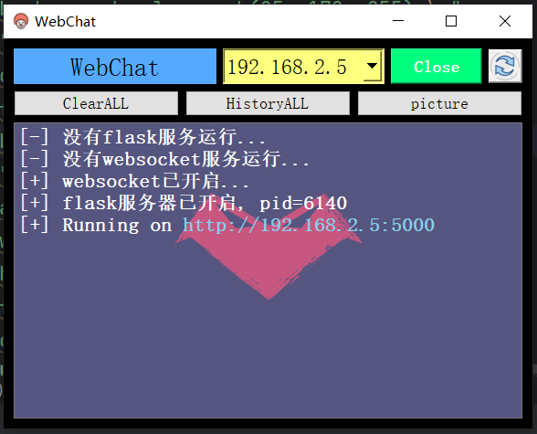

# LANCOM

基于PyQt5开发的局域网通信与文件传输，使用websocket技术实现，可以同时多人聊天，目前仅适用于window

### 安装

```python
pip install -r requirements.txt
```

### 使用方式一

直接运行`main.py`文件

```python
python main.py
```

### 使用方式二

使用`pyinstaller`打包成可执行文件后使用，执行以下命令会自动安装打包可执行文件（主目录下）

```python
python pyinstall_self.py
```

打包完后执行`main.exe`文件即可使用

### 结果展示

BS控制端



CS端


